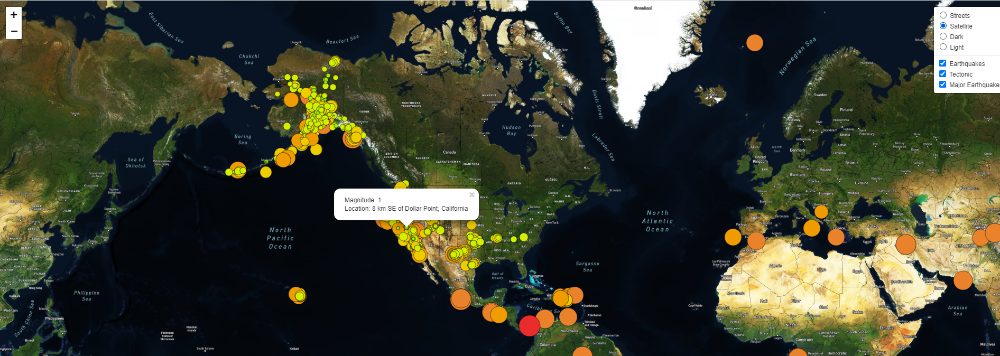
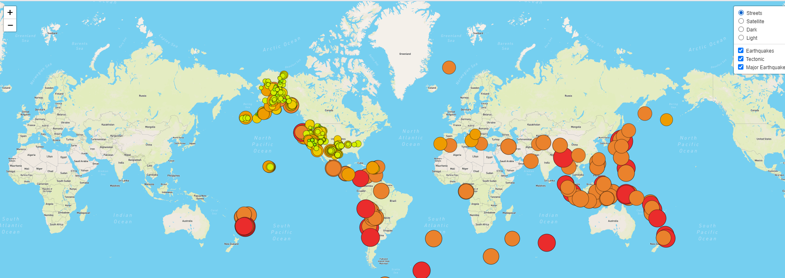
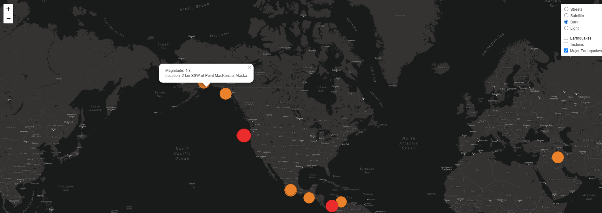

# Mapping Earthquakes overview analysis
Using our knowledge of JavaScript, Leaflet.js, and geoJSON data.
we add tectonic plate data using d3.json(), 
add the data using the geoJSON() layer, 
set the tectonic plate LineString data to stand out on the map, and add the tectonic plate data to the overlay object with the earthquake data.
finally we add major earthquake data to the map using d3.json(), and a color and set the radius of the circle based on the magnitude of earthquake, and add a popup marker for each earthquake that displays the magnitude and location of the earthquake using the GeoJSON layer, geoJSON().

## Module 13 challenge summary
    map 1 earthquakes, map 2 tectonics, map 3 major earthquakes
    3 overlays 1 extra for fun (street, satellite, dark, light)

